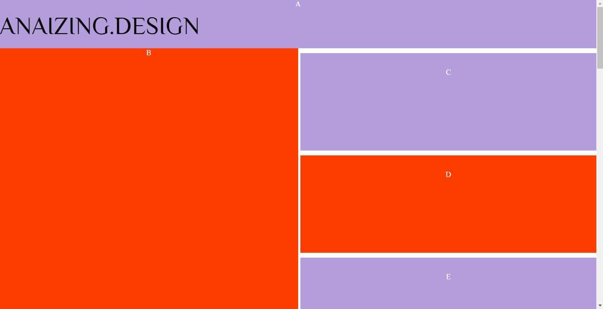

# One 

Here both A(the header) and B(image link), have been fixed onto screen, so they are not using display:grid properties, the rest of the 
cells on  the #right-side scroll. So although only the #right-side scrolls, excluding the header, Ive placed the grid on the full
width and height of the screen.
### I devided the screen like this...

          #right-scroll{
              display: grid;
              grid-template-columns: repeat(2, 1fr);
              grid-template-rows: 100px repeat(14, 200px);
              max-width: 100%;
              margin: 0;
              grid-gap: 10px;
          }

## Here is the HTML

        <!DOCTYPE html>
        <html>
          <head>
            <meta charset="utf-8">
            <title>Grid Layouts by ANAIZING.DESIGN </title>
            <link rel="stylesheet" type="text/css" href="grid.css"/>
            <link href="https://fonts.googleapis.com/css?family=Philosopher" rel="stylesheet">
            </head>
          <body>

            
A

            
B

            

                
C

                
D

                
E

                
F

                
G

                
H

                
I

                
J

                
K

                
L

                
M

                
N

                
O

                
P

                
ANAIZING.DESIGN

            

          </body>
        </html>

## Here is the CSS
          
          body{
              color: #fff;
              font-family: 'Philosopher';
              text-align: center;
              margin: 0;
          }

          #right-scroll{
              display: grid;
              grid-template-columns: repeat(2, 1fr);
              grid-template-rows: 100px repeat(14, 200px);
              max-width: 100%;
              margin: 0;
              grid-gap: 10px;
          }

          #right-scroll div{
              background: #B39DDB;
              padding: 30px;
              grid-column: 2/3;
          }

          #right-scroll div:nth-child(even){
              background: #FF3D00;
          }

          .A{
              display: grid;
              width: 100%;
              height: 100px;
              position: fixed;
              margin: 0;
              z-index: 1;
              background-color: #B39DDB;
          }
          .B{
              width: 50%;
              height: 100%;
              position: fixed;
              margin-top: 100px;
              background-color: #FF3D00;

          }
          .C{
              grid-row: 2;
          }
          .D{
              grid-row: 3;
          }
          .E{
              grid-row: 4;
          }
          .F{
              grid-row: 5;
          }
          .G{
              grid-row: 6;
          }
          .H{
              grid-row: 7;
          }
          .I{
              grid-row: 8;
          }
          .J{
              grid-row: 9;
          }
          .K{
              grid-row: 10;
          }
          .L{
              grid-row: 11;
          }
          .M{
              grid-row: 12;
          }
          .N{
              grid-row: 13;
          }
          .O{
              grid-row: 14;
          }
          .P{
              grid-row: 15;
          }
          .anaizing{
              color: #000;
              font-size: 50px;
              z-index: 1;
              position: fixed;
              margin-top: 25px;
          }

          @media (max-width: 480px)
          {
              .B{
                  display: none;
              }
              #right-scroll div{
                  grid-column: 1/3;
              }
              .anaizing{
                  font-size: 35px;
              }
          }

I also added media queries so side B is hidden on smaller devices, while the #right-side scroll area moves places on the grid column to take up the full phone screen.

## You can see it in action on my codepen...

https://codepen.io/Anaizing/pen/wpGRqB
