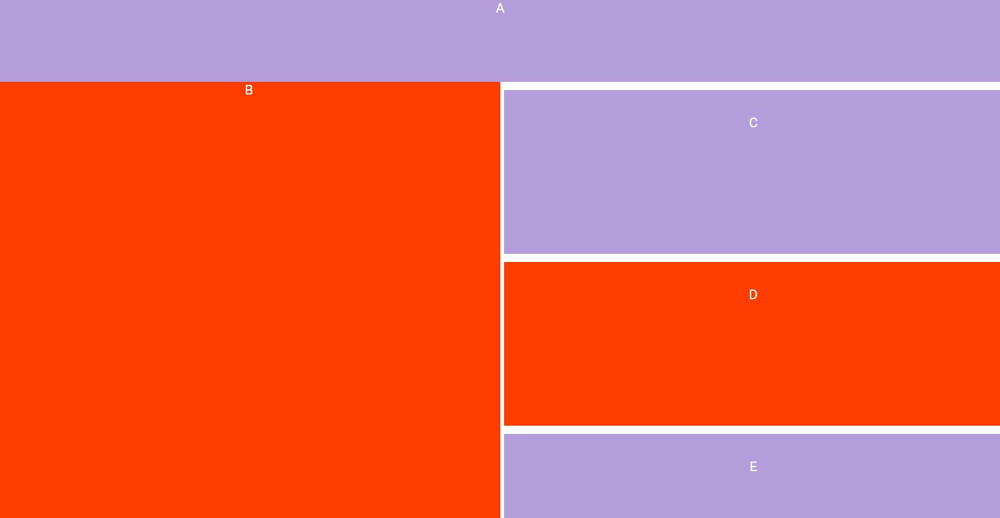

# COPYCAT-series-CSS-Grid
### A series of web layouts where I attempt to copy existing web pages using CSS Grid... without copying anyone's code

## One

## Here is the code
https://github.com/Anaizing/COPYCAT-series-CSS-Grid/blob/master/One-%20The%20Code.md

## You can see it in action on my codepen...

https://codepen.io/Anaizing/pen/wpGRqB

## Two

## Here is the code

## You can see it in action on my codepen...

https://codepen.io/Anaizing/pen/GyWjQM
