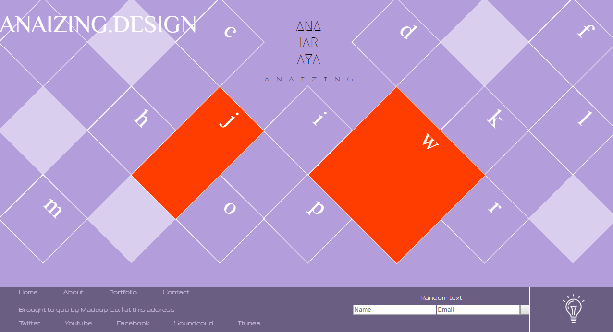

# Two 

## Here is the HTML

                  <!DOCTYPE html>
                  <html>
                      <head>
                          <meta charset="utf-8">
                          <link rel="stylesheet" href="index.css">
                          <link href="https://fonts.googleapis.com/css?family=Philosopher" rel="stylesheet">
                          <link href="https://fonts.googleapis.com/css?family=Megrim" rel="stylesheet">
                          <link href="https://fonts.googleapis.com/css?family=Gruppo" rel="stylesheet">

                          <title>Diamond grid layout by ANAIZING.DESIGN</title>
                      </head>
                      <body>

                  

                    
ANAIZING.DESIGN

                    

                    

                        b 

                    

                    
c

                    
d

                    
e

                    
f

                    
g

                    
h

                    
i

                    
j

                    
k

                    
l

                    
m

                    
n

                    
o

                    
p

                    
q

                    
r

                    
s

                    
w

                    
ANAIZING

                    
 ANA IAR AYA

                    

                        <nav>
                            <ul class="nav">
                                <li><a>Home.</a></li>
                                <li><a>About.</a></li>
                                <li><a>Portfolio.</a></li>
                                <li><a>Contact.</a></li>
                            </ul>
                            
 Brought to you by Madeup Co. | at this address

                            <ul class="social">
                                <li><a>Twitter</a></li>
                                <li><a>Youtube</a></li>
                                <li><a>Facebook</a></li>
                                <li><a>Soundcoud</a></li>
                                <li><a>Itunes</a></li>
                            </ul>
                        </nav>
                    

                    

                        <form>
                            Random text
                            <input id="Name" type="text" placeholder="Name">
                            <input id="Email" type="text" placeholder="Email">
                            <button></button>
                        </form>
                    

                    

                        </img>
                    

                  

                      </body>
                  </html>

## Here is the CSS
 

           body {
              margin: 0;
              height: 100vh;
              width: 100vw;
              /*
              background-size: cover;
              background-image: url(https://images.unsplash.com/photo-1504257365157-1496a50d48f2?auto=format&fit=crop&w=1500&q=80), url(https://images.unsplash.com/photo-1474631245212-32dc3c8310c6?auto=format&fit=crop&w=924&q=80), linear-gradient(aqua, red);
              background-blend-mode: overlay;
          */
              font-size: 50px;
              color: #fff;
              text align: center;
              background-color: #B39DDB;
          }

          .canvas {
              display: grid;
              grid-template-columns: repeat(7, 183.8px);
              grid-template-rows: repeat(3, 183.8px) 50px 97px;
          }

          .diamonds {
              background: none;
              border: solid #fff;
              border-width: 0.8px;
              height: 130px;
              width: 130px;
              text-align: center;
              transform: rotate(45deg) translate(35px);
          }

          .b, .g, .e, .n, .s {
              background-color: #fff;
              opacity: 0.5;
          }

          .j {
              grid-column: 3;
              grid-row: 2;
              height: 260px;
              width: 130px;
              transform: rotate(45deg) translate(-10px, 20px);
              background-color: #FF3D00;
              z-index:1;
          }

          .w {
              grid-column: 5;
              grid-row: 2;
              height: 260px;
              width: 260px;
              transform: rotate(45deg) translate(10px, 65px);
              background-color: #FF3D00;
          }

          .heading {
              margin-top: 40px;
              grid-column: 4;
              grid-row: 1;
              font-size: 30px;
              text-align: center;
              font-family: 'Megrim';
              color: #000;
          }

          .diamond-text {
              margin-top: 160px;
              color: #000;
              font-size: 15px;
              font-family: 'Gruppo';
              letter-spacing: 15px;
              text-align: center;
              grid-column: 4;
              grid-row: 1;
          }

          .footer{
              grid-row: 5/6;
              width: 100vw;
              background-color: #000;
              opacity: 0.4;
              z-index: 0;
              margin: 0;
              padding: 0;
          }

          nav ul{
              grid-row: 5/6;
              list-style: none;
              height: 50px;
              margin: 0;
              padding: 0;
              margin-top: -25px;
              z-index: 1;
          }

          nav li{
              display: inline-block;
              font-size: 15px;
              margin-left: 40px;
          }

          .nav,{
              margin-top: -30px;
          }
          .social{
              margin-top: -30px;
          }
           nav p{
               height: 15px;
               font-size: 15px;
               margin-left: 40px;
               padding: 0px;
           }
          .form{
               grid-row: 5/6;
               grid-column: 5/7;
               border-left: 1px solid white;
               padding-top: 15px;
               z-index: 1;
           }
          form{
              display: grid;
              grid-template-columns: 2fr 2fr 1fr;
              grid-template-rows: 1fr 1fr;
              grid-gap: 1px;
              font-size: 15px;

          }
          span{
              grid-column: 1/4;
              text-align: center;
          }
          button{
              padding: 0;
          }
          .logo{
              grid-column: 7/8;
              grid-row: 5/6;
              border-left: 1px solid white;
              text-align: center;
              padding-top: 15px;
              z-index: 1;
          }
          .social, .nav, p, form{
              font-family: 'Gruppo';
          }
          .anaizing {
              color: #fff;
              font-size: 50px;
              z-index: 1;
              position: fixed;
              margin-top: 25px;
          }

